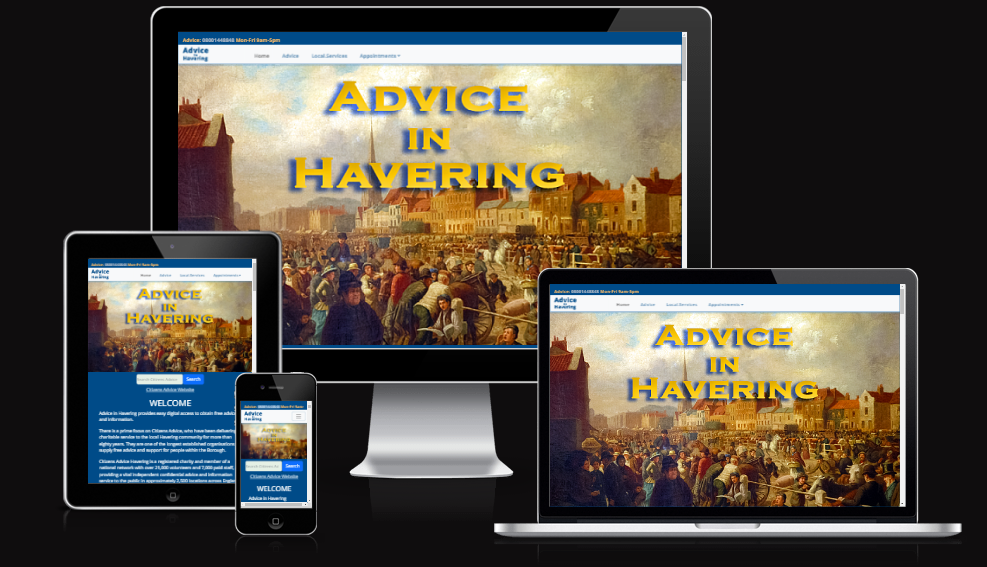
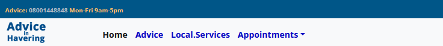
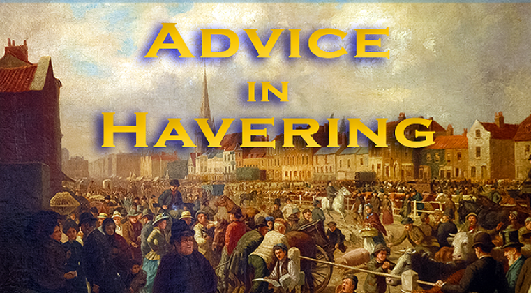
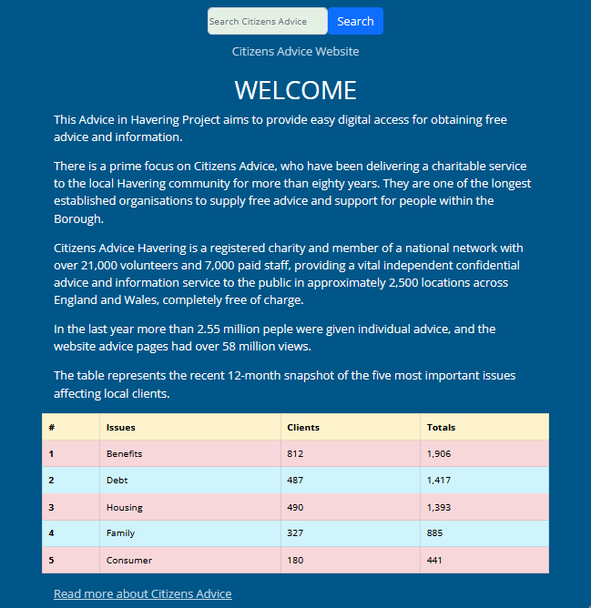

# Advice Project

This Advice in Havering website is an experimental project, which aims to be mobile friendly, providing easy access to free advice and support information, mainly for the local community. There are also important National telephone and website links.

Although, primarily focussed on the extensive public advice services provided by Citizens Advice, other charity organisations within the London Borough of Havering, do offer similar assistance, but none with the same extensive National support infrastructure.

You may view the Advice in Havering website [here.](https://roly5573.github.io/Advice-Project/){:target="_blank"} 

## Table of Contents

- [Target Users](#target-users)
- [Project Goals](#project-goals) 
- [Description](#description)
- [Design](#design)
- [Colors and Fonts](#colors-and-fonts)
- [Features](#features)
- [Contact Form](#contact-form)
- [User Experience](#user-experience)
- [Testing](#testing)
- [Issues and bugs](#issues-and-bugs)

## Target Users

This website project is aimed at anyone who may require information or advice, particularly within the London Borough of Havering. Increasingly more people are using the internet on the go via mobile phones, and may not normally access websites on desktop computers, or even tablets.   

## Project Goals
- Ensure website information and advice links are relevant as well as mobile friendly, making browsing and a search process easy for users.
- Keep the website simple to navigate.
- Take feedback and suggestions into consideration when expanding features.

## Description

The site consists of one fully responsive continuous scrolling page, divided into sections, starting with an animated Header image, including the navigation section with a dropdown. This is followed by the main body with advice contacts features, including a short embedded video. Finally closing with a responsive contact form, and footer section consisting of web and social media links.

## Design

## Colors and Fonts

## Features

- Fully Responsive Navbar consisting of advice telephone number link for mobile, and dropdown links to other sections within the website.

- Animated Hero image upon site opening.

- A search box which integrates with the public search function on the Citizens Advice Website. A homepage link is also here.
- A Welcome section including a table highlighting social issues affecting clients at Citizens Advice in Havering, 
 
 This is then followed by the main body with features including a short embedded video. Finally, it closes with a responsive contact form, and footer with links.

## Contact Form

- Detailed instructions on how to download and install the necessary software to run the website.
- Step-by-step guide to running the website on a local machine.
- Any other relevant instructions or tips for users who want to use the website.

## User Experiences

- Guidelines for contributing to the website, including any code standards, processes for submitting pull requests, and information on how to get involved.

## Testing

## Issues and Bugs

