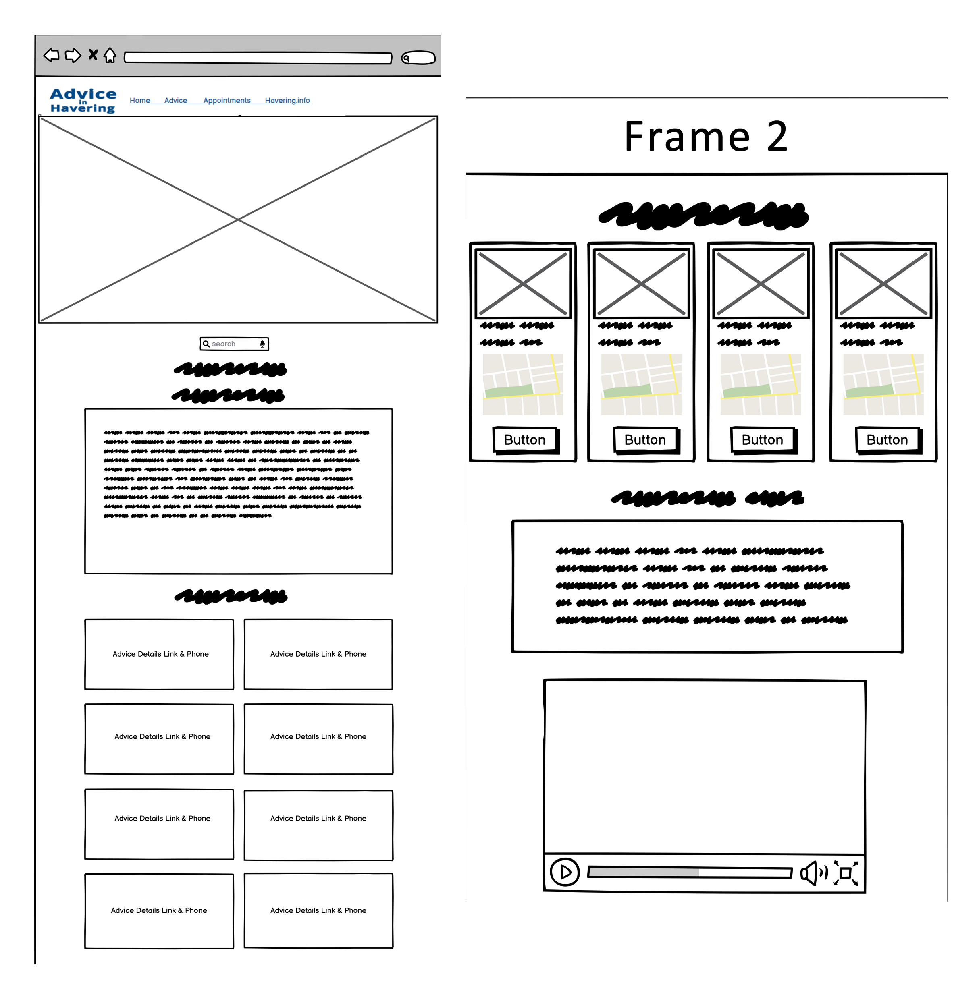
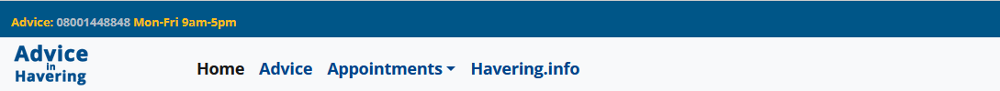
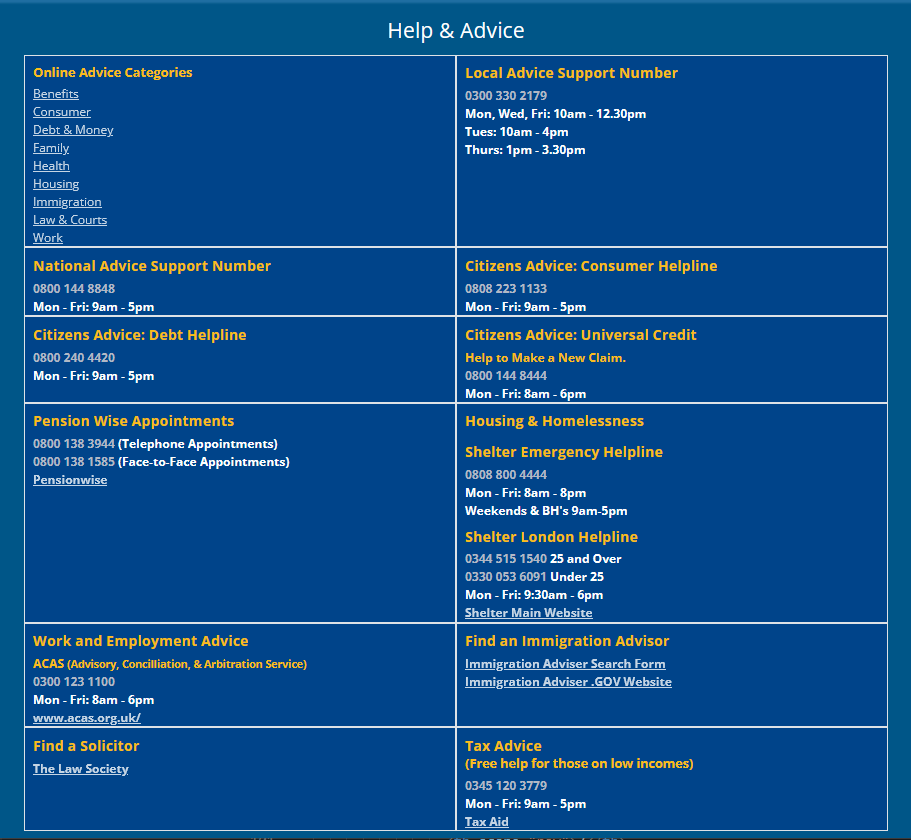
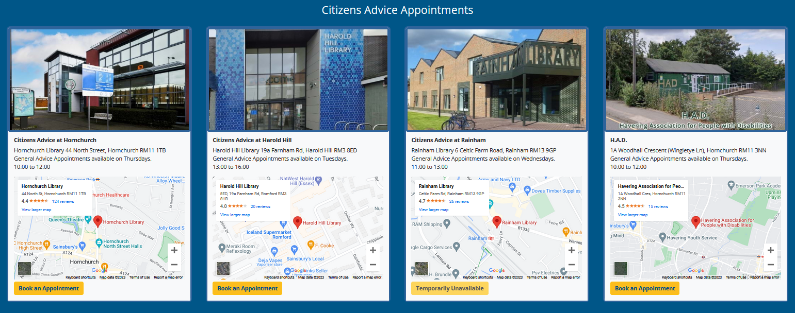
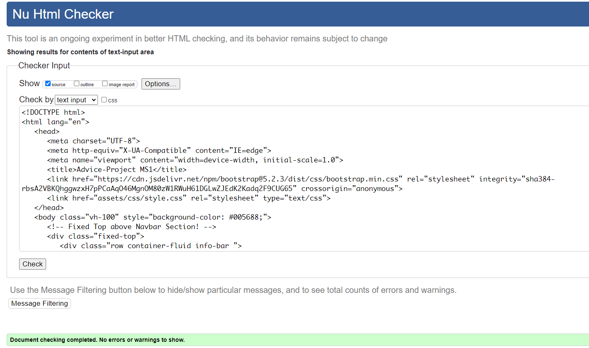
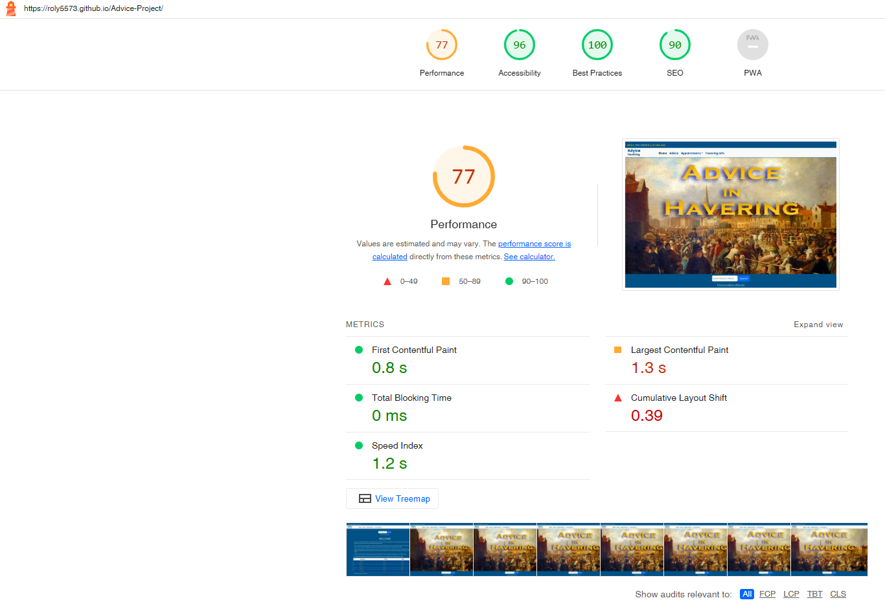

# Advice Project

This Advice in Havering website is an experimental project, which aims to be mobile friendly, providing easy access to free advice and support information, mainly for the local community who live or work within the London Borough of Havering. There are also important National telephone and website links.

Although the site is primarily focused on the extensive public advice services provided by the Citizens Advice Service, there are other charity organisations within the London Borough of Havering, who offer similar assistance to the public, but none with the same extensive National support infrastructure.

You may view my Advice in Havering website 
[here.](https://roly5573.github.io/Advice-Project/)

# Table of Contents

- [Advice Project Intro](#advice-project)
- [User Experience (UX)](#user-experience-ux)
- [Project Goals](#project-goals) 
- [Description](#description)
- [Design](#design)
- [Technologies](#technologies)
- [Files Structure](#files-structure)
- [Colors](#colors)
- [Main Body Features](#main-body-features)
- [Contact Form](#contact-form)
- [Footer](#footer)
- [Deployment](#deployment)
- [Testing](#testing)
- [Issues and bugs](#issues-and-bugs)
- [Testing User Experience (UX)](#testing-user-experience-ux)
- [Future Improvements](#future-improvements)
- [Credits and Acknowledgements](#credits-and-acknowledgements)

# User Experience (UX)
## First Time Visitor Goals
- As a First Time Visitor to the site, I want to know what the purpose of the site is.
- As a First Time Visitor to the site, I would like to navigate through the site content easily.
- As a First Time Visitor to the site, I would like to find out more about Citizens Advice.
## Returning Visitor Goals
- As a Returning Visitor I want to contact the the Local Authority.
- As a Returning Visitor I would like to find help regarding housing.
- As a Returning Visitor I would like to get in contact to ask any questions that I may have.
## Frequent User Goals
- As a Frequent User, I would like to see if there is any new contact information.

# Project Goals
- Ensure website information and advice links are relevant as well as mobile friendly. 
- Making browsing and a search process easy for users.
- Keep the website simple to navigate.
- Take feedback and suggestions into consideration when expanding features.
- 

# Description
The Advice Project site consists of one fully responsive continuous scrolling page, divided into sections, starting with an animated Header image, including the navigation section with a dropdown. This is followed by the main body with advice contacts features, including a short embedded video. Finally closing with a collapsible responsive contact form, and footer section consisting of general advice and social media links.
Using a single scrolling page, rather than several pages for sections of the website, seems to make more sense whilst navigating using a mobile or tablet device, especially as the information on offer throuhout, is related by content.
There is no site photo or media gallery, to display, which would have made sense in either of those instances, to use more than one page.

# Design
- Initially I used a rough sketch to see what I wanted to achieve. 
- I only used [Balsamiq](https://balsamiq.com/wireframes/) to create a layout of the sections of the website.
 
 

# Technologies
- HTML5
- CSS3
- [Bootstrap 5.2.3](https://getbootstrap.com/docs/5.2/getting-started/introduction/) is used throughout the website.
- Bootstrap Javascript CDN (Content Delivery Network). 
- [Google Fonts](https://fonts.google.com/) Open Sans, (Sans Serif family) are used throught the website. Open Sans is the default choice of the Citizens Advice organisation.
- [Google Maps](https://www.google.com/maps) Maps are used in the Bootstrap Cards and for location of Romford Library.
- Adobe Photoshop used for image refinement.
- Used [Irfan View](https://www.irfanview.com/) for easy resizing of photos.
# Files Structure
## Advice Project
### home
- [index.html](https://github.com/Roly5573/Advice-Project/blob/main/index.html)
### assets
- [css](https://github.com/Roly5573/Advice-Project/tree/main/assets/css/)
- [images](https://github.com/Roly5573/Advice-Project/tree/main/assets/images)
- [rmedia](https://github.com/Roly5573/Advice-Project/tree/main/assets/rmedia)
- [videos](https://github.com/Roly5573/Advice-Project/tree/main/assets/videos)
### pages
- [thankyou.html](https://github.com/Roly5573/Advice-Project/blob/main/pages/thankyou.html)

### README
- [README.md](https://github.com/Roly5573/Advice-Project/blob/main/README.md)

# Colors
- Main Website Colors chosen for easy visual contrast.

# Main Body Features
## Header Section
## Navbar with Logo

- A simplistic text logo is used for the navbar.

- Fully Responsive Navbar consisting of advice telephone number link for mobile, and dropdown links to other sections within the website.

- Animated Hero image upon site opening.

- Photograph of a painting credited to the artist Louis Burleigh Bruhl circa 1891. 	
- Full editable rights is granted to me by the Havering Libraries Local Studies Centre - who possess the original artwork, along with others which may in the future, be utilised without restrictions.
- A search box which integrates with the public search function on the Citizens Advice Website. Here is a link to the main [Citizens Advice Homepage.](https://www.citizensadvice.org.uk)
- A Welcome section including a table highlighting social issues affecting clients at Citizens Advice in Havering.
- The table creation was inspired by an exercise from the Bootstrap Whiskey course material. 
 
 - [Read more about Citizens Advice](https://www.citizensadvice.org.uk/about-us/about-us1/introduction-to-the-citizens-advice-service/)
 ## Introduction to Citizens Advice at Romford
- Brief introduction to Citizens Advice in Romford including a map for directions.

## Help and Advice
- Mostly public Citizens Advice Links which include some active Telephone Numbers available for mobile devices.

## Appointments with booking links
- Fully Responsive Bootstrap 5.2 cards and submit buttons, reconfigured to a consistent fit with images and Google Maps, as well as links for appointment bookings. 

## Cost of Living Information and Video
- More about Citizens Advice with embedded Video and link to [Cost-of-Living Data Dashboard.](https://public.flourish.studio/story/1634399/)

- video can be played on device, or on Youtube via the button link.
## Havering Information
- A very brief introduction to the London Borough of Havering.

## Local Services within Havering
- Local services with links and Active Telephone numbers for mobile devices.

# Contact Form
- Contact form is collapsed by default, but activated by Contact/Feedback button.

- Contact form freely available and adapted for use from [formsubmit.co](https://formsubmit.co/)  
- Name, Email Address, and Message inputs are all required for successful form submit.
- Thank You Page message with back to homepage button. 
 
- Example email message reply.

# Footer
- General Advice, Government, and Social Media Links.

- All links open in a new tab or window.

# Deployment
## The Project was deployed as follows:

- Signed in to Git Hub and opened my [Advice-Project Repository](https://github.com/Roly5573/Advice-Project)
- Selected Settings and navigated to Pages under the Code and Automation menu.
- Under the Build and Deployment menu, Deploy from a branch was chosen from the Source dropdown.
- My Branch called main was selected, along with the root of the repository, and saved.
- A message box informed me that the site was now deployed and live, together with the website [link.](https://roly5573.github.io/Advice-Project/)

# Testing
- Website was continuously checked during development using the relevant Tools from Google Chrome, Microsoft Edge, Firefox, and Opera. (I had no access to the Apple Safari Browser).
- I always stuck to the mobile first principle and this was the guiding factor during the build.
- Bootstrap elements of containers, rows, and columns, kept any normal working errors at a minimum.
- Tested using Lighthouse regularly, with variried Performance results.
## [Chrome DevTools ](https://developer.chrome.com/docs/devtools/)
- Chrome DevTools used throughout the process of building the site, to test and modify html elements and css styles.
## W3 Validation
## [W3 HTML Validation Check](https://validator.w3.org/)
- W3 HTML index.html validator check 17-06-2023

- W3 HTML thankyou.html validator check 17-06-2023

## [W3 CSS Validation Check](https://jigsaw.w3.org/css-validator/)

- W3 CSS validator check on 17-06-2023

## Lighthouse Test 1
- Microsoft Edge Site Tools (Desktop) 17-06-2023

## Lighthouse Test 2
- Microsoft Edge Site Tools (Mobile) 17-06-2023

## Other Online Testing
 ### [GTmetrix](https://gtmetrix.com/) 
 - Performance Test 17-06-2023

## Reponsive Testing
- The website is fully responsive from a very small xs size of 320px wide, up to a large screen size, although I have only been able to test the site up to 1920px wide. 

# Issues and Bugs
- My own up to date copy of Chrome Browser gives a false reponsive reading when checking small widths, such as an iphone 5, displaying an overlap by the footer. This only occurs at that small size.
  
- I have tried Chrome on other devices without any issues with any screen sizes. It happens with some online checks also.
- Initial contact form attempts using a Bootstrap modal, were unsuccessful, and in the end I opted for the hidden space method of a dropdown, for the Contact Form.
# Testing User Experience (UX)
### First Time Visit
1. As a First Time Visitor to the site, I would like to know whhat the purpose of the site is.
- The purpose of the website is to provide information and contacts of the free advice and support services available to the public, mainly within the London Borough of London, but some important national advice contacts are also available.
2. As a First Time Visitor to the site, I would like to navigate through the site content easily.
- Navigation of the website is very easy and starts with links available from the Navbar. The site is a scrollable page, and the advice sections are clearly seperated, firstly with Citizens Advice related services, followed by localised services within Havering.
3. As a First Time Visitor to the site, I would like to find out more about Citizens Advice.
- You can use this [link](https://www.citizensadvice.org.uk/about-us/about-us1/introduction-to-the-citizens-advice-service/) which takes you to the About Page of Citizens Advice. This link can be found in the Welcome Section of the website
### Returning Visitor Goals
1. As a Returning Visitor I want to contact the a Local Authority.
- If you wish to contact Havering Council, you can navigate to the Local Havering Services Section. For any other Local Authority in London, there is a link in the footer section, to the London Councils Website.
2. As a Returning Visitor I want to find help regarding housing.
- Citizens Advice have highly qualified advisers who can help, and there are also contact details, in the Help and Advice section of the website, for Shelter, a national housing advice service, who provide free and comprehensive housing advice.
3. As a Returning Visitor I want to find out how to send a message and ask any questions.
- A contact and Feedback form is available for questions, suggestions and feedback.
### Frequent User Goals
1. As a Frequent User, I would like to see if there is any new contact information.
- New contacts and information will be added once the sources can be verified.
# Future Improvements
- Expansion of website including other Charities and Organisations offering Free Advice.
- Create a directory for the website from current public information sources for ease of access.
- Provide links for important public announcements.
 # Credits and Acknowledgements
## Photo Credits
- The Hero picture is a photograph of a painting credited to the artist Louis Burleigh Bruhl circa 1891. 
- Used from flickr by badgreeb pictures with a Creative Commons Attribution-ShareAlike (CC BY-SA 2.0).
- Research is ongoing to find the source of the original painting.  
- All other photographs are my own, with the exception of The Havering Association for Disabled Peoples as used in the Appointments section of the website. This is from Google Maps.

## Appreciation
- I would like to say a huge thank you to Iris at Code Institute, for endless enthusiasm, good humour, and encouragement, in her drive to get the course project completed. 
- Also to Marcel, my mentor, whose technical insight has been instumental in guiding me throughout the project. 

 [Return to Table of Contents](#table-of-contents)