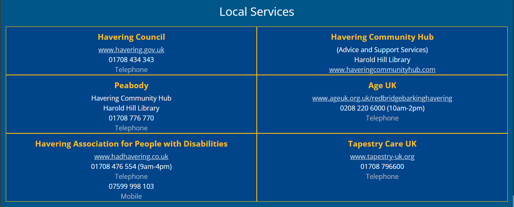
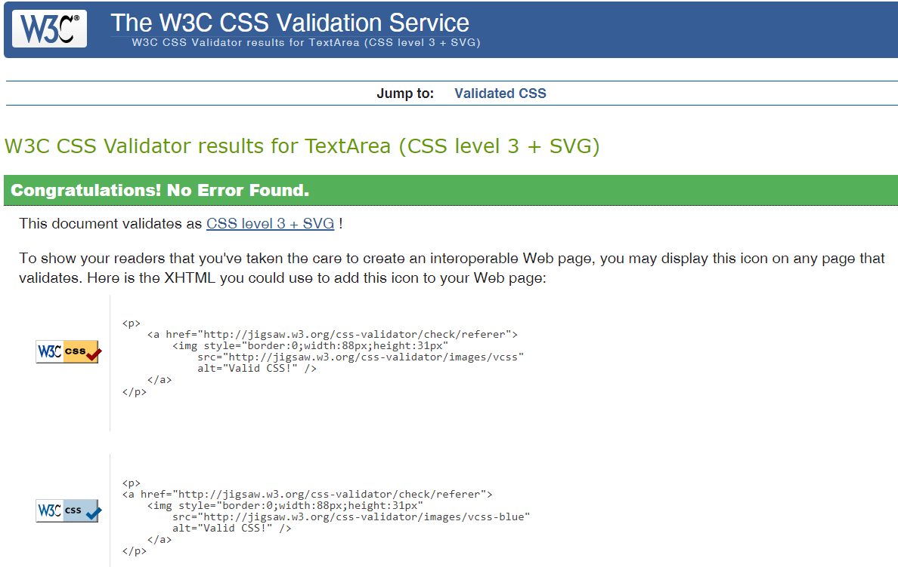
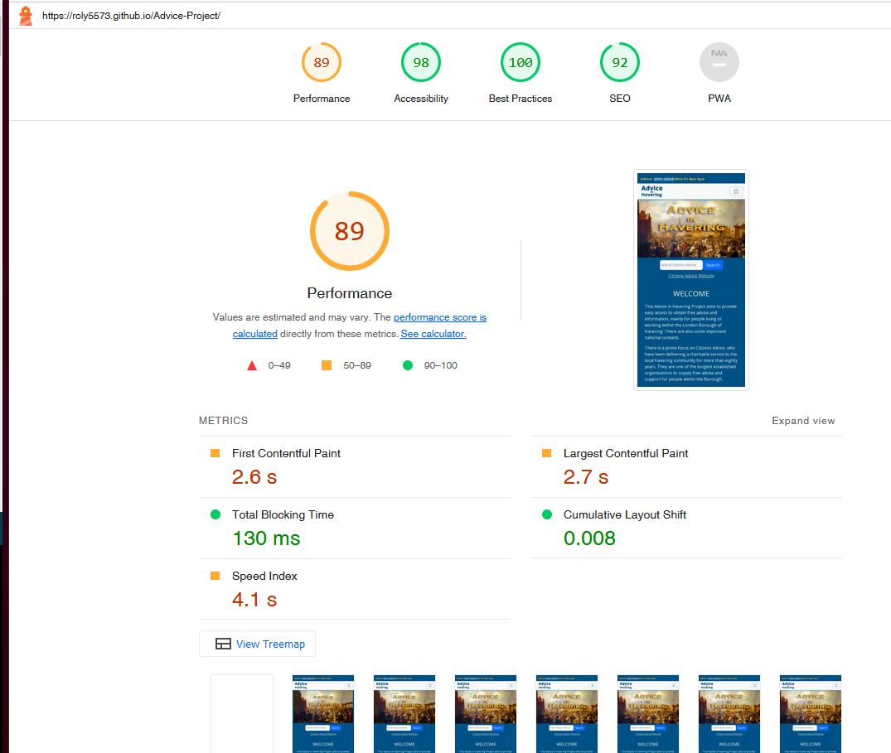

# Advice Project

This Advice in Havering website is an experimental project, which aims to be mobile friendly, providing easy access to free advice and support information, mainly for the local community. There are also important National telephone and website links.

Although the site is primarily focussed on the extensive public advice services provided by Citizens Advice, other charity organisations within the London Borough of Havering, do offer similar assistance to the public, but none with the same extensive National support infrastructure.

You may view my Advice in Havering website 
[here.](https://roly5573.github.io/Advice-Project/)

# Table of Contents

- [Targeted Users](#targeted-users)
- [Project Goals](#project-goals) 
- [Description](#description)
- [Design](#design)
- [Colors](#colors-and-fonts)
- [Main Body Features](#main-body-features)
- [Contact Form](#contact-form)
- [Footer](#footer)
- [Feedback from Users](#feedback-from-users)
- [Testing](#testing)
- [Issues and bugs](#issues-and-bugs)
- [Future Improvements](#future-improvements)
- [Credits and Acknowledgements](#credits-and-acknowledgements)

# Targeted Users

This website project is aimed at anyone who may require information or advice, particularly within the London Borough of Havering. Increasingly more people are using the internet on the go via mobile phones, and may not normally access websites on desktop computers, or even tablets.   

# Project Goals
- Ensure website information and advice links are relevant as well as mobile friendly 
- Making browsing and a search process easy for users.
- Keep the website simple to navigate.
- Take feedback and suggestions into consideration when expanding features.

# Description
The site consists of one fully responsive continuous scrolling page, divided into sections, starting with an animated Header image, including the navigation section with a dropdown. This is followed by the main body with advice contacts features, including a short embedded video. Finally closing with a responsive contact form, and footer section consisting of general advice and social media links.

# Design
- Initially I used a rough sketch to see what I wanted to achieve. 
- I started to use [Balsamiq](https://balsamiq.com/wireframes/) to create a layout, but because my site is mainly supplying directory style information with contact links, I found their basic structual layouts not very practical, and decided an ongoing column and row approach to adding contact details was a better solution.
## Technologies
- HTML5
- CSS3
- [Bootstrap 5.2.3](https://getbootstrap.com/docs/5.2/getting-started/introduction/) 
- Bootstrap Javascript CDN (Content Delivery Network) 
- [Google Fonts](https://fonts.google.com/) Open Sans, (Sans Serif family) are used throught the website.
- [Google Maps](https://www.google.com/maps) Maps are used in the Bootstrap Cards and for location of Romford Library.
- Adobe Photoshop for image refinement.
- Downloaded [Irfan View](https://www.irfanview.com/) For easy resizing of photos.
## Files Structure
### Advice Project
#### home
- [index.html](https://github.com/Roly5573/Advice-Project/blob/main/index.html)
#### assets
- [css](https://github.com/Roly5573/Advice-Project/tree/main/assets/css/)
- [images](https://github.com/Roly5573/Advice-Project/tree/main/assets/images)
- [rmedia](https://github.com/Roly5573/Advice-Project/tree/main/assets/rmedia)
- [videos](https://github.com/Roly5573/Advice-Project/tree/main/assets/videos)
#### pages
- [thankyou.html](https://github.com/Roly5573/Advice-Project/blob/main/pages/thankyou.html)

#### README
- [README.md](https://github.com/Roly5573/Advice-Project/blob/main/README.md)

# Colors
- Main Website Colors chosen for easy visual contrast.

# Main Body Features
## Header Section
## Navbar with Logo

- A simplistic text logo for the navbar.

- Fully Responsive Navbar consisting of advice telephone number link for mobile, and dropdown links to other sections within the website.

- Animated Hero image upon site opening.

- Photograph of a painting credited to the artist Louis Burleigh Bruhl circa 1891. 	
- Attribution-ShareAlike (CC BY-SA 2.0)
- A search box which integrates with the public search function on the Citizens Advice Website. Here is a link to the main [Citizens Advice Homepage](https://www.citizensadvice.org.uk)
- A Welcome section including a table highlighting social issues affecting clients at Citizens Advice in Havering.
- The table creation was inspired by an exercise from the Bootstrap Whiskey course material. 
 
 ## Introduction to Citizens Advice at Romford
- Brief introduction to Citizens Advice in Romford including a map for directions.

## Help and Advice
- These are mostly Important public Citizens Advice Links which include some active Telephone Numbers available to be called by touch on mobile devices.

## Appointments with booking links
- Fully Responsive Bootstrap 5.2 cards and submit buttons, reconfigured to a consistent fit with images and Google Maps, as well as links for appointment bookings. 

## Cost of Living Information and Video
- More about Citizens Advice with embedded Video and link to [Cost-of-Living Data Dashboard](https://public.flourish.studio/story/1634399/)

- video can be played on device, or on Youtube via the button link.
## Havering Information
- A very brief introduction to the London Borough of Havering.

## Advice Services in Havering
- Local services with links and Active Telephone numbers for mobile devices.

# Contact Form
- Contact form is hidden by default but activated by Contact/Feedback button.

- Contact form freely available and adapted for use from [formsubmit.co](https://formsubmit.co/)  
- Name, Email Address, and Message inputs are all required for successful form submit.
- Thank You Page message with back to homepage button. 
 
- Example email message reply.

# Footer
- General Advice, Government, and Social Media Links.

- All links open in a new tab or window.
# Feedback from Users
- First impession is good, but needs more contacts.
- Plenty of information sources all in one place. Nicely laid out, covers local services with current times and places.
- Nice website, could you add HMRC contacts, please?

# Testing
### W3 Validation
- W3 HTML index.html validator check 01-05-2023

- W3 HTML thankyou.html validator check 01-05-2023

- W3 CSS validator check on 01-05-2023

- Website was continuously checked during development using the relevant Tools from Google Chrome, Microsoft Edge, Firefox, and Opera. (I had no access to the Apple Safari Browser).
- I always stuck to the mobile first principle and this was the guiding factor during the build.
- Bootstrap elements of containers, rows, and columns, kept any normal working errors at a minimum.
- Tested using Lighthouse regularly, with variried Performance results.
### Lighthouse Test 1
- Microsoft Edge Site Tools (Desktop) 01-05-2023

### Lighthouse Test 2
- Microsoft Edge Site Tools (Mobile) 01-05-2023

### Lighthouse Test 3
- Google Chrome 01-05-2023

### Reponsive Testing
- The website is fully responsive from a very small xs size of 320px wide, up to a large screen size, although I have only been able to test the site up to 1920px wide. 

# Issues and Bugs
- My own up to date copy of Chrome Browser gives a false reponsive reading when checking small widths, such as an iphone 5, displaying an overlap by the footer. This only occurs at that small size.
  
- I have tried Chrome on other devices without any issues with any screen sizes. It happens with some online checks also.
- Initial contact form attempts using a Bootstrap modal, were unsuccessful, and in the end I opted for the hidden space method of a dropdown.

# Future Improvements
- Expansion of Free Advice Charities and Organisations with access for local people.

# Credits and Acknowledgements
## Photo Credits
- The Hero picture is a photograph of a painting credited to the artist Louis Burleigh Bruhl circa 1891. 
- Used from flickr by badgreeb pictures with a Creative Commons Attribution-ShareAlike (CC BY-SA 2.0).
- Research is ongoing to find the source of the original painting.  
- All other photographs are my own, with the exception of The Havering Association for Disabled Peoples as used in the Appointments section of the website. This is from Google Maps.

